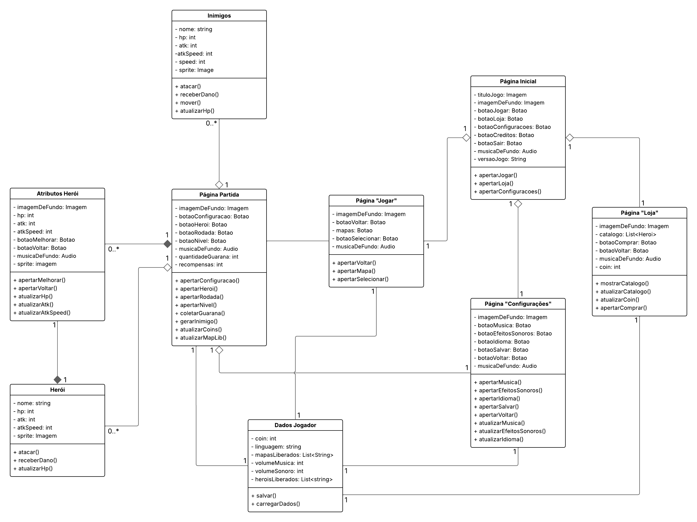
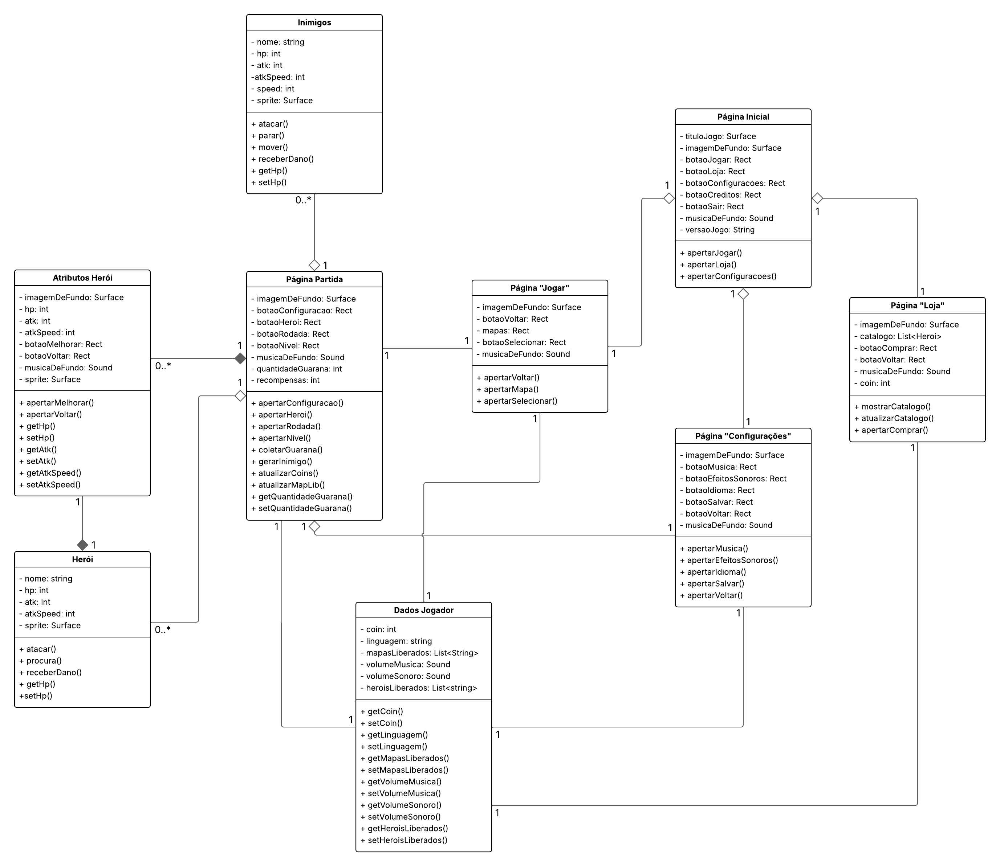
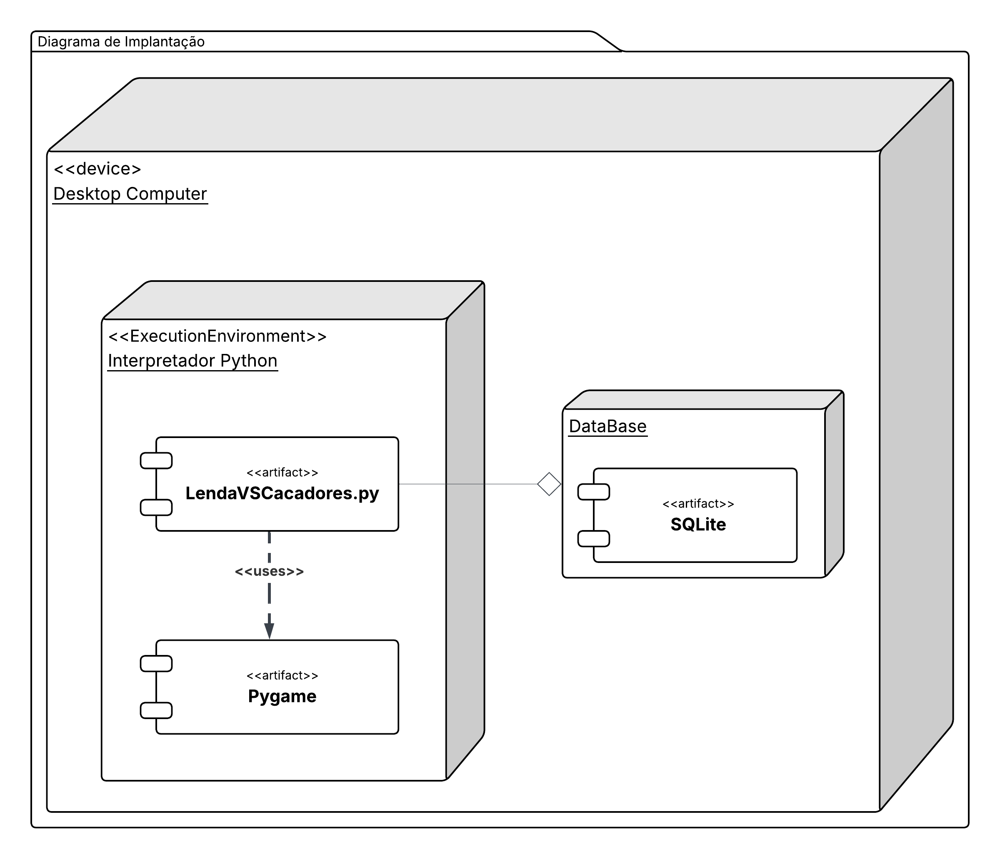
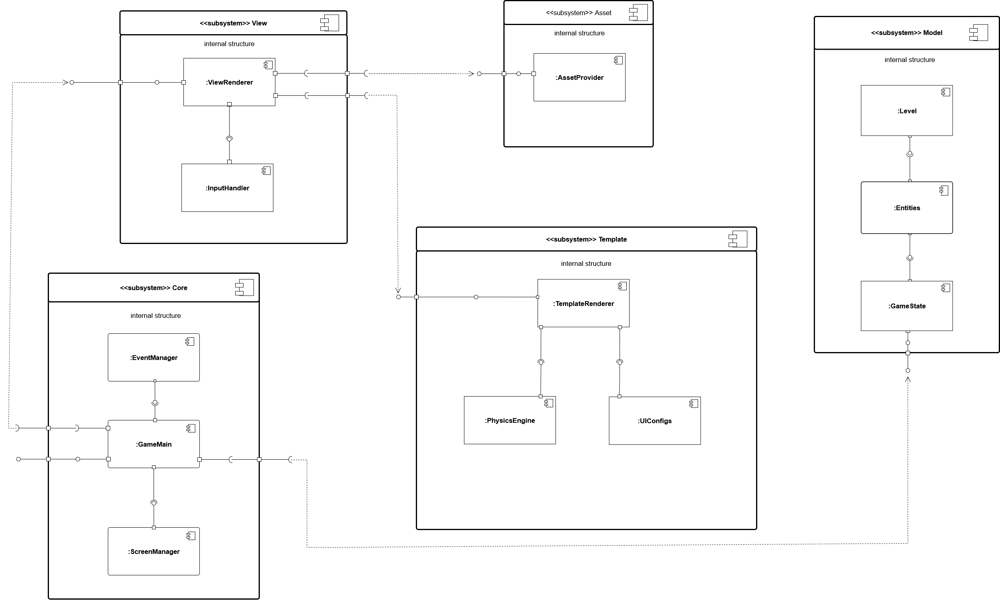

# 2.1. Módulo Modelagem Estática UML

## Introdução

A **Modelagem Estática** na **Unified Modeling Language (UML)** é
fundamental para representar a estrutura de um sistema de software.
Enquanto a modelagem dinâmica foca nos comportamentos e interações ao
longo do tempo, a modelagem estática concentra-se nos **elementos
estruturais**, como classes, pacotes e componentes, além das relações
entre eles.

Essa abordagem fornece uma **visão arquitetural clara**, ajudando tanto
analistas quanto desenvolvedores a compreender a organização interna do
sistema, identificar dependências e planejar a implementação de forma
mais robusta. A UML, mantida pela **Object Management Group (OMG)**,
oferece símbolos padronizados para representar esses aspectos,
favorecendo a comunicação entre todos os envolvidos no projeto.

## Metodologia

A metodologia aplicada pelo grupo se baseou em três representações
principais da modelagem estática em UML:

1. **Diagrama de Classes** – Mostra a estrutura interna do sistema,
detalhando classes, atributos, métodos e relacionamentos.

2. **Diagrama de Implantação** – Evidencia a vizualização dos processadores nos dispositivos de um sistema, links de comunicação e a colocação de um arquivo de software nesse hardware.

3. **Diagrama de Componentes** – Ilustra os blocos de software que podem
ser implementados e implantados, mostrando interfaces e conexões entre
eles.

O processo metodológico envolveu:

- **Revisão conceitual** da notação UML estática.  
- **Escolha de exemplos práticos** aplicados ao projeto da disciplina.  
- **Modelagem dos três diagramas**, com ênfase em papéis, dependências e
organização estrutural.  

## Participantes

Tabela 1: Participantes

<table>
  <thead>
    <tr>
      <th>Nome</th>
      <th>Função</th>
      <th>Data</th>
      <th>Hora</th>
    </tr>
  </thead>
  <tbody>
    <tr>
      <td><a href="https://github.com/caioduart3">Caio Duarte</a></td>
      <td>Diagrama de Implantação</td>
      <td>20/09/2025</td>
      <td>15:30</td>
    </tr>
    <tr>
      <td><a href="https://github.com/danielle-soaress">Danielle Soares</a></td>
      <td>Diagrama de Implantação</td>
      <td>20/09/2025</td>
      <td>15:30</td>
    </tr>
    <tr>
      <td><a href="https://github.com/EnzoEmir">Enzo Emir</a></td>
      <td>Diagrama de Classes</td>
      <td>21/09/2025</td>
      <td>01:00</td>
    </tr>
    <tr>
      <td><a href="https://github.com/felixlaryssa">Laryssa Félix</a></td>
      <td>Diagrama de Componentes</td>
      <td>20/09/2025</td>
      <td>20:00</td>
    </tr>
    <tr>
      <td><a href="https://github.com/Leticia-Arisa-K-Higa">Leticia Arisa</a></td>
      <td>Diagrama de Classes</td>
      <td>21/09/2025</td>
      <td>01:00</td>
    </tr>
    <tr>
      <td><a href="https://github.com/MM4k">Marcelo Makoto</a></td>
      <td>Diagrama de Classes</td>
      <td>21/09/2025</td>
      <td>01:00</td>
    </tr>
    <tr>
      <td><a href="https://github.com/dudaa28">Maria Eduarda</a></td>
      <td>Diagrama de Implantação</td>
      <td>20/09/2025</td>
      <td>15:30</td>
    </tr>
    <tr>
      <td><a href="https://github.com/RafaelSchadt">Rafael Welz</a></td>
      <td>Diagrama de Componentes</td>
      <td>20/09/2025</td>
      <td>20:00</td>
    </tr>
    <tr>
      <td><a href="https://github.com/VictorPontual">Victor Pontual</a></td>
      <td>Diagrama de Componentes</td>
      <td>20/09/2025</td>
      <td>20:00</td>
    </tr>
  </tbody>
</table>

Fonte: Equipe do Projeto, 2025.

## Desenvolvimento

## 2.1.1 Diagrama de Classes

Tabela 2: Participantes Classes

<table>
  <thead>
    <tr>
      <th>Nome</th>
    </tr>
  </thead>
  <tbody>
    <tr>
      <td><a href="https://github.com/EnzoEmir">Enzo Emir</a></td>
    </tr>
    <tr>
      <td><a href="https://github.com/Leticia-Arisa-K-Higa">Leticia Arisa</a></td>
    </tr>
    <tr>
      <td><a href="https://github.com/MM4k">Marcelo Makoto</a></td>
    </tr>
  </tbody>
</table>

O **Diagrama de Classes** é provavelmente o mais utilizado na UML, pois representa a **espinha dorsal** de um sistema orientado a objetos.  
Ele descreve as **classes** (entidades de software), seus **atributos** (dados que cada objeto guarda) e seus **métodos** (funcionalidades que os objetos podem executar).  

Além disso, o diagrama mostra as **relações entre classes**, que podem assumir diferentes formas:  
- **Associação** → ligação genérica entre classes.  
- **Herança (generalização/especialização)** → quando uma classe “filha” herda características da “classe mãe”.  
- **Agregação** → relação “todo-parte” mais fraca, onde a parte pode existir sem o todo.  
- **Composição** → relação “todo-parte” mais forte, onde a parte só existe junto com o todo.  

Esse diagrama é amplamente usado no **design do software** porque tem correspondência direta com o código em linguagens como Java, Python e C#.As informações para a elaboração desta seção foram retiradas das referências <a href="#REF4">4</a> e <a href="#REF5">5</a>.   

<iframe width="560" height="315" src="https://www.youtube.com/embed/Hxe16odUVmw" title="YouTube video player" frameborder="0" allowfullscreen></iframe>

 

Após uma conversa com a professora, foram sugeridas algumas mudanças e melhorias no diagrama. Para implementar essas sugestões, foi necessário desenvolver as estruturas básicas das classes. O processo de implementação e o resultado final podem ser visualizados no vídeo abaixo:

 

<iframe width="560" height="315" src="https://www.youtube.com/embed/p-m22NroSl8" title="YouTube video player" frameborder="0" allowfullscreen></iframe>

O link para o projeto pode ser acessado clicando [aqui](https://lucid.app/lucidchart/5cd3fd91-4f5f-429e-a1fe-61390a291387/edit?viewport_loc=-2111%2C849%2C2844%2C1298%2C0_0&invitationId=inv_1ec7e2d0-d361-480a-b8fb-66792f85c9e3).

 

#### Comentários sobre o Trabalho em Equipe

A elaboração desta etapa foi realizada de forma colaborativa em reunião pelo **Microsoft Teams**, onde os três membros designados estiveram presentes e participaram ativamente da discussão/elaboração.  
O processo de modelagem foi feito no **Lucidchart**, ferramenta que possibilitou a criação e edição simultânea do diagrama, garantindo integração e alinhamento entre os integrantes.  

Durante o encontro, cada participante contribuiu com sugestões e validações, assegurando que o resultado final refletisse a visão conjunta do grupo. Essa abordagem colaborativa favoreceu não apenas a qualidade do diagrama produzido, mas também a sinergia do time e a clareza na divisão de responsabilidades.

Opiniões pessoais:

  
<strong><a href="https://github.com/EnzoEmir">Enzo Emir</a></strong>

  
Sobre o diagrama de classes, achei difícil inicialmente, porém, ao me aprofundar mais na teoria, o trabalho começou a fluir melhor. Além disso, a dica da professora foi extremamente valiosa para esse diagrama, após a implementação do código, muita coisa mudou/foi melhorada.

  
<strong><a href="https://github.com/Leticia-Arisa-K-Higa">Leticia Arisa</a></strong>

  
Eu achei o diagrama de classes um pouco difícil, principalmente porque foi necessário definir primeiro a estrutura do código das classes. Como a gente ainda não tinha uma ideia totalmente definida do sistema e, no meu caso, pela falta de experiência em desenvolvimento de jogos, acabou ficando um pouco complicado organizar e representar corretamente as classes no diagrama.

  
<strong><a href="https://github.com/MM4k">Marcelo Matoko</a></strong>

  
No começo foi difícil organizar as ideias para começar a realizar o Diagrama de Classes. Porém, ao entender mais a fundo sobre as suas dinâmicas, como atributos, métodos, relacionamentos e cardinalidades, a construção do diagrama se tornou mais flúida e de fácil realização. Em geral, essa foi uma boa experiência e eu achei fácil de entender as relações entre as diversas classes feitas no projeto ao final dessa elaboração.

---

## 2.1.2 Diagrama de Implantação

Tabela 3: Participantes Implantação

<table>
  <thead>
    <tr>
      <th>Nome</th>
    </tr>
  </thead>
  <tbody>
    <tr>
      <td><a href="https://github.com/caioduart3">Caio Duarte</a></td>
    </tr>
    <tr>
      <td><a href="https://github.com/danielle-soaress">Danielle Soares</a></td>
    </tr>
    <tr>
      <td><a href="https://github.com/dudaa28">Maria Eduarda</a></td>
    </tr>
  </tbody>
</table>

Fonte: Maria Eduarda, 2025.

O **Diagrama de Implantação** é um tipo de representação de diagrama UML, que mostra a
a arquitectura de um sistema, incluindo nós e associações *(relacionamentos de comunicação)*, como ambiente de execução de hardware ou software e o middleware *(Software que atua como uma camada de comunicação e integração entre diferentes aplicações e sistemas)* que os conecta <a href="#REF2">2</a> <a href="#REF3">3</a>.

Esse diagrama é usado para modelar e demonstrar o ambiente em que o sistema será executado, nos ajudando a compreender e vizualizar como o sistema funciona em um **ambiente real**.

Além disso, o Diagrama de Implantação:  

- Representa **nós físicos** (como servidores, dispositivos móveis, sensores, computadores) e **ambientes de execução** (máquinas virtuais, contêineres, sistemas operacionais).  
- Mostra como os **artefatos de software** (executáveis, bibliotecas, arquivos de configuração, componentes implantados) são distribuídos nesses nós.  
- Pode detalhar **protocolos e conexões de rede** utilizados na comunicação entre os elementos.  
- É útil para documentar tanto a **infraestrutura física** quanto a **infraestrutura lógica**, apoiando decisões de arquitetura e infraestrutura de TI.  
- Ajuda a validar aspectos de **desempenho, escalabilidade e segurança**, ao ilustrar claramente onde cada parte do sistema está implantada.  

Ou seja, esse diagrama conecta a visão lógica do sistema (componentes, classes) à sua **realidade física de execução**, sendo essencial para projetos que precisam considerar **infraestrutura, comunicação e implantação de software** <a href="#REF1">1</a>.

A seguir esta imagem mostra a execução do diagrama de implantação sobre a aplicação **Jogo Digital Tower Defense minimalista  - Lendas vs Caçadores inspirado em Plant vs Zombiens**:

Fonte: Caio Duarte, Danielle Soares, Maria Eduarda, 2025.

Este diagrama de implantação ilustra a **arquitetura de tempo de execução da aplicação (jogo)**, mostrando a distribuição dos artefatos de software em seus nós de hardware.  

#### Nós de Hardware  

- **Computadores Pessoais (PCs)** (`<<device>> Desktop Computer`):  
  Este é o nó principal onde a aplicação é executada. Engloba dispositivos desktops de mesa ou notebooks/laptops. 

#### Ambientes de Execução  

- **Interpretador Python** (`<<ExecutionEnvironment>> Interpretador Python`):  
  Um ambiente de execução dentro do Computador de Mesa que gerencia a execução dos artefatos baseados em Python.  

#### Artefatos e Relações  

- **LendaVSCacadores.py** (`<<artifact>>`):  
  O artefato principal do jogo. Ele é executado pelo Interpretador Python.  

- **Pygame** (`<<artifact>>`):  
  Uma biblioteca usada pelo jogo *LendaVSCacadores.py*.  
  A dependência é indicada pela seta `<<uses>>`, mostrando que o jogo depende de **Pygame** para funcionar.  

- **SQLite** (`<<artifact>>`):  
  Um banco de dados local que interage diretamente com o jogo *LendaVSCacadores.py*.  
  A conexão é representada por uma linha com um diamante no meio, mostrando a associação entre os dois artefatos.  

A aplicação **LendaVSCacadores** é executada em um **Computador de Mesa** usando o **Interpretador Python**.  
Ela utiliza a biblioteca **Pygame** para suas funcionalidades e interage com um **banco de dados SQLite** para armazenar informações.  

#### Comentários sobre o Trabalho em Equipe

A elaboração desta etapa foi realizada em reunião pelo **Discord**, não gravada, contando com a participação ativa dos três membros designados para o **Diagrama de Implantação**. Dois integrantes estiveram presentes diretamente na execução prática do diagrama, enquanto um membro contribuiu no estudo aprofundado sobre o componente, seus elementos principais e na documentação principal.  

De forma **presencial e online**, todos os três membros — **Caio Duarte, Danielle Soares e Maria Eduarda Andrade** — participaram ativamente do **Foco 1**, garantindo integração e alinhamento entre teoria e prática.  

A ferramenta utilizada para a elaboração do diagrama foi o **Lucidchart**, possibilitando a criação colaborativa e edição simultânea, o que favoreceu a organização do processo e a clareza na modelagem. O link para o projeto pode ser acessado clicando [aqui](https://lucid.app/lucidchart/6aa26612-22f1-4651-a0d7-c54b78b03330/edit?viewport_loc=186%2C-1875%2C3049%2C1671%2C0_0&invitationId=inv_0a9bc33d-37fb-4bee-b82c-5f83ec9641c9) (é necessário login).

A participação dos integrantes na elaboração do **Foco 1** trouxe visões e opiniões distintas, enriquecendo o trabalho desenvolvido:  

  
<strong><a href="https://github.com/caioduart3">Caio Duarte</a></strong>

  
Sobre o diagrama estático de implantação, achei difícil e abstrato de aplicar em implantações de software que não sejam mobile ou web, como é o caso de softwares desktop offline.

  
<strong><a href="https://github.com/danielle-soaress">Danielle Soares</a></strong>

  
Eu particularmente achei o diagrama de implantação muito difícil de encontrar uma notação padrão, tendo uma grande variação de exemplos na internet e materiais didáticos. Além disso, a maioria deles se tratam de sistemas on-line. Por isso, tive dificuldade de entender como funciona esse diagrama.

  
<strong><a href="https://github.com/dudaa28">Maria Eduarda Andrade</a></strong>

  
Achei a atividade bem útil, principalmente pra minha área de interesse em banco de dados, porque deu pra entender melhor como ele se conecta e atua na aplicação. No caso do nosso jogo <em>Torrent Defence: Lendas vs Caçadores</em>, o diagrama ajudou a visualizar como tudo se organiza, porém mesmo sendo uma ferramenta de ajuda, tive uma dificuldade bastante grande para compreende-lo.

 

---

## 2.1.3 Diagrama de Componentes

Tabela 4: Participantes Componentes

<table>
  <thead>
    <tr>
      <th>Nome</th>
    </tr>
  </thead>
  <tbody>
    <tr>
      <td><a href="https://github.com/felixlaryssa">Laryssa Félix</a></td>
    </tr>
    <tr>
      <td><a href="https://github.com/RafaelSchadt">Rafael Welz</a></td>
    </tr>
    <tr>
      <td><a href="https://github.com/VictorPontual">Victor Pontual</a></td>
    </tr>
  </tbody>
</table>

O *Diagrama de Componentes* fornece uma *visão arquitetural de alto nível* do jogo.  
Ele mostra os principais *subsistemas* e seus *componentes internos*, além das conexões que estabelecem dependências e comunicação entre eles. 

O diagrama foi construido no software *Draw.io, por isso a qualidade da imagem é diminuída quando exportada para o **GitPages*. Para ver tudo em alta definição, basta clicar na imagem do diagrama ou [aqui](https://drive.google.com/file/d/1mdIYz5-ulT01tfqCfF-S7d2PyivSM0yC/view).

Fonte: Rafael Schadt, Laryssa Felix, Victor Pontual, 2025.

### Subsistemas e Componentes  

### *1. View*  
Responsável pela *renderização gráfica* e pelo *tratamento de entrada do usuário*.  

- *Componentes internos:*  
    - *ViewRenderer* → Gerencia a renderização visual da interface do jogo.  
    - *InputHandler* → Captura e interpreta entradas do jogador (teclado, mouse, controle).  

- *Conexões:*  
    - Se conecta ao *Asset* para obter recursos gráficos.  
    - Interage com o *Core* para reagir a eventos e estados do jogo.  

### *2. Asset*  
Gerencia todos os *recursos externos* do jogo, como imagens, sons e modelos.  

- *Componente interno:*  
    - *AssetProvider* → Responsável por disponibilizar os recursos solicitados pelos outros subsistemas.  

- *Conexões:*  
    - Fornece recursos para o *View* (texturas, sprites, etc.).  
    - Pode ser acessado pelo *Template* caso precise de recursos de interface.  

### *3. Model*  
Representa a *lógica do mundo do jogo* e seus dados.  

- *Componentes internos:*  
    - *Level* → Define os níveis/fases do jogo.  
    - *Entities* → Estrutura que contém os personagens, objetos e inimigos.  
    - *GameState* → Armazena e gerencia o estado atual da partida.  

- *Conexões:*  
    - Se comunica com o *Core* para manter o estado geral do jogo atualizado.  
    - Fornece informações para o *View* exibir os elementos corretos na tela.  

### *4. Core*  
É o *núcleo central* do jogo, responsável pela coordenação geral.  

- *Componentes internos:*  
    - *EventManager* → Controla eventos do jogo (entrada, colisão, transições).  
    - *GameMain* → Classe principal que inicializa e coordena a execução.  
    - *ScreenManager* → Gerencia as telas (menu, jogo, pause, game over).  

- *Conexões:*  
    - Interage diretamente com *View, **Model* e *Template*, sendo o ponto de integração.  
    - Atua como mediador para o fluxo do jogo.  

### *5. Template*  
Responsável por lidar com *renderização adicional, **física* e *configurações de interface*.  

- *Componentes internos:*  
    - *TemplateRenderer* → Gera elementos da interface e organiza renderização extra.  
    - *PhysicsEngine* → Processa a física do jogo (movimento, colisões).  
    - *UIConfigs* → Armazena e aplica configurações da interface gráfica.  

- *Conexões:*  
    - Trabalha junto ao *Core* para aplicar física e regras de interface.  
    - Pode solicitar recursos do *Asset*.  

### Conexões entre Subsistemas  

- *View ↔ Asset* → ViewRenderer requisita recursos gráficos ao AssetProvider.  
- *View ↔ Core* → InputHandler envia eventos, e ViewRenderer recebe estados para renderizar.  
- *Core ↔ Model* → Core atualiza e consulta GameState, Entities e Levels.  
- *Core ↔ Template* → GameMain e ScreenManager utilizam TemplateRenderer e PhysicsEngine.  
- *Template ↔ Asset* → TemplateRenderer pode usar recursos gráficos fornecidos pelo Asset.

  <iframe width="560" height="315" src="https://www.youtube.com/embed/fH08iYdSeAY?si=6hTKulXRuigWaGRV" 
    title="YouTube video player" frameborder="0" 
    allow="accelerometer; autoplay; clipboard-write; encrypted-media; gyroscope; picture-in-picture; web-share" 
    referrerpolicy="strict-origin-when-cross-origin" allowfullscreen>
  </iframe>

### Comentários sobre o Trabalho em Equipe

A elaboração desta etapa foi realizada de forma colaborativa em reunião pelo *MIcrosoft Teams*, gravada,  onde os três membros designados estiveram presentes e participaram ativamente da discussão/elaboração.  
O processo de modelagem foi feito no *Draw.io*, ferramenta que possibilitou a criação e edição simultânea do diagrama, garantindo integração e alinhamento entre os integrantes.  

Opiniões pessoais:

  
<strong><a href="https://github.com/felixlaryssa">Laryssa Félix</a></strong>

  
Fazer o diagrama de componentes foi bem interessante porque consegui visualizar, de forma concreta, como os subsistemas do jogo se relacionam. Quando coloquei em prática ficou claro como cada parte depende da outra. Isso me ajudou a enxergar a arquitetura de uma forma mais aplicada e menos abstrata.

  
<strong><a href="https://github.com/RafaelSchadt">Rafael Schadt</a></strong>

  
Achei positivo também o fato de termos construído o diagrama em grupo. Cada um trouxe uma visão diferente sobre os componentes, e isso enriqueceu bastante o resultado. Percebi que modelagem de software não é só técnica, mas também comunicação entre as pessoas envolvidas no projeto.

  
<strong><a href="https://github.com/VictorPontual">Victor Pontual</a></strong>

  
Percebi o quanto esse tipo de diagrama ajuda na organização do trabalho. Ter os subsistemas e suas responsabilidades definidos desde já dá uma base sólida para quando formos implementar. Isso evita confusões no futuro, porque já temos uma visão arquitetural que guia nossas decisões técnicas.

## Referência Bibliográfica

> <a id="REF1">1.</a> UML-DIAGRAMS. Deployment Diagrams Overview. Disponível em: <https://www.uml-diagrams.org/deployment-diagrams-overview.html>. Acesso em: 20 set. 2025.  

> <a id="REF2">2.</a> CREATELY BLOG. Tutorial do Diagrama de Implantação. Disponível em: <https://creately.com/blog/pt/diagrama/tutorial-do-diagrama-de-implantacao/>. Acesso em: 20 set. 2025.  

> <a id="REF3">3.</a> YOUTUBE. O que é Diagrama de Implantação UML? Disponível em: <https://www.youtube.com/watch?v=DgERD0HgggQ>. Acesso em: 20 set. 2025. 

> <a id="REF4">4.</a> YOUTUBE. Tutorial de Diagramas de Classes UML. Disponível em: <https://www.youtube.com/watch?v=rDidOn6KN9k>. Acesso em: 21 set. 2025. 

> <a id="REF5">5.</a> UML Class and Object Diagrams Overview. Disponível em: <https://www.uml-diagrams.org/class-diagrams-overview.html>. Acesso em: 21 set. 2025. 

## Histórico de Versões 📅

| Versão | Data | Descrição | Autor(es) | Revisor(es) |
| :--: | :--: | :--: | :--: | :--: |
| 0.1 | 17/09/2025 | Criação da página, textos explicativos, contribuição para o Diagrama de Classes | [Enzo Emir](https://github.com/EnzoEmir), [Leticia Arisa](https://github.com/Leticia-Arisa-K-Higa), [Marcelo Makoto](https://github.com/MM4k) | [Maria Eduarda Andrade](https://github.com/dudaa28) |
| 0.2 | 20/09/2025 | Diagrama de Implantação | [Caio Duarte](https://github.com/caioduart3), [Danielle Soares](https://github.com/danielle-soaress), [Maria Eduarda Andrade](https://github.com/dudaa28) | [Caio Duarte](https://github.com/caioduart3), [Danielle Soares](https://github.com/danielle-soaress) |
| 0.3 | 20/09/2025 | Corrigindo imagem do diagrama de implantação, adicionando link do Lucidchart | [Caio Duarte](https://github.com/caioduart3), [Danielle Soares](https://github.com/danielle-soaress) | - |
| 0.4 | 21/09/2025 | Correção do Diagrama de Classes | [Enzo Emir](https://github.com/EnzoEmir), [Leticia Arisa](https://github.com/Leticia-Arisa-K-Higa), [Marcelo Makoto](https://github.com/MM4k) | - |
| 0.5 | 21/09/2025 | Documentação do Diagrama de Componentes | [Laryssa Felix](https://github.com/felixlaryssa), [Rafael Schadt](hhttps://github.com/RafaelSchadt), [Victor Pontual](https://github.com/VictorPontual) | - |

Fonte: Equipe do Projeto, 2025.
