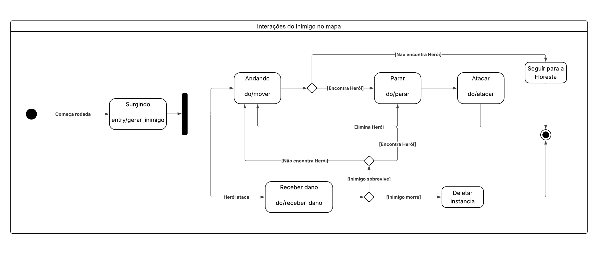
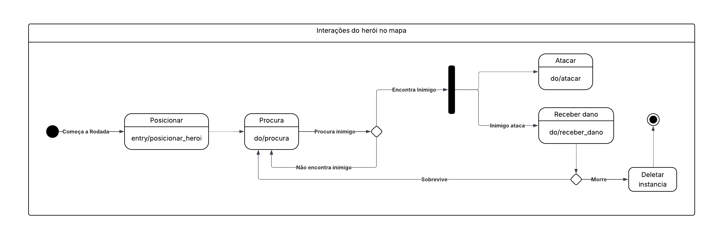
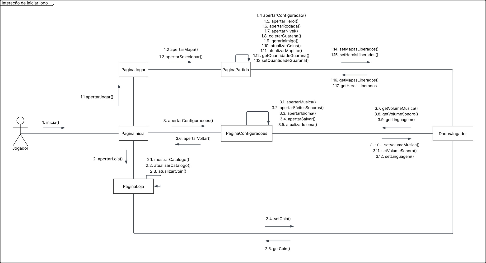
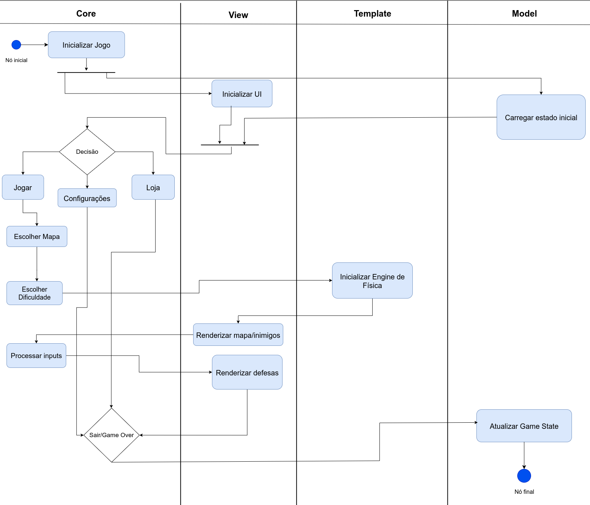

# 2.2. Módulo Notação UML – Modelagem Dinâmica

## Introdução

A modelagem dinâmica na UML (Linguagem de Modelagem Unificada) foca no comportamento dinâmico de um sistema. Ela complementa a modelagem estática ao detalhar a interação entre os objetos e as mudanças de estado interna em resposta a eventos. Em vez de apenas mostrar a estrutura, ela captura o fluxo de atividades e a lógica de operação do sistema. 

## Metodologia

A metodologia aplicada pelo grupo se baseou em três representações principais da modelagem dinâmica em UML:

1. **Diagrama de Estados** – Ilustra o ciclo de vida de um único objeto ou entidade, detalhando os estados pelos quais ele passa e as transições que ocorrem em resposta a eventos.

2. **Diagrama de Comunicação** –  Evidencia a colaboração e as ligações entre os objetos, focando nos relacionamentos e nas trocas de informação para executar uma tarefa.

3. **Diagrama de Atividades** – Representa o fluxo de trabalho de um sistema ou processo de negócio, mostrando a sequência de ações e o fluxo de controle, similar a um fluxograma.

O processo metodológico envolveu:

* Revisão conceitual da notação UML dinâmica.

* Escolha de exemplos práticos aplicados ao projeto da disciplina.

* Modelagem dos três diagramas, com ênfase nas transições de estado, fluxo de mensagens e sequências de atividades.

## Participantes

Tabela 1: Participantes

<table>
  <thead>
    <tr>
      <th>Nome</th>
      <th>Função</th>
      <th>Data</th>
      <th>Hora</th>
    </tr>
  </thead>
  <tbody>
    <tr>
      <td><a href="https://github.com/caioduart3">Caio Duarte</a></td>
      <td>Diagrama de Comunicação</td>
      <td>21/09/2025</td>
      <td>18:00</td>
    </tr>
    <tr>
      <td><a href="https://github.com/danielle-soaress">Danielle Soares</a></td>
      <td>Diagrama de Comunicação</td>
      <td>21/09/2025</td>
      <td>18:00</td>
    </tr>
    <tr>
      <td><a href="https://github.com/EnzoEmir">Enzo Emir</a></td>
      <td>Diagrama de Estados</td>
      <td>21/09/2025</td>
      <td>01:40</td>
    </tr>
    <tr>
      <td><a href="https://github.com/felixlaryssa">Laryssa Félix</a></td>
      <td>Diagrama de Atividadess</td>
      <td>21/09/202</td>
      <td>11:00</td>
    </tr>
    <tr>
      <td><a href="https://github.com/Leticia-Arisa-K-Higa">Leticia Arisa</a></td>
      <td>Diagrama de Estados</td>
      <td>21/09/2025</td>
      <td>01:40</td>
    </tr>
    <tr>
      <td><a href="https://github.com/MM4k">Marcelo Makoto</a></td>
      <td>Diagrama de Estados</td>
      <td>21/09/2025</td>
      <td>01:40</td>
    </tr>
    <tr>
      <td><a href="https://github.com/dudaa28">Maria Eduarda</a></td>
      <td>Diagrama de Comunicação</td>
      <td>21/09/2025</td>
      <td>18:00</td>
    </tr>
    <tr>
      <td><a href="https://github.com/RafaelSchadt">Rafael Welz</a></td>
      <td>Diagrama de Atividadess</td>
      <td>21/09/2025</td>
      <td>11:00</td>
    </tr>
    <tr>
      <td><a href="https://github.com/VictorPontual">Victor Pontual</a></td>
      <td>Diagrama de Atividadess</td>
      <td>21/09/2025</td>
      <td>11:00</td>
    </tr>
  </tbody>
</table>

Fonte: Equipe do Projeto, 2025.

## 2.2.1 Diagrama de Estados  

Tabela 2: Participantes Estados

<table>
  <thead>
    <tr>
      <th>Nome</th>
    </tr>
  </thead>
  <tbody>
    <tr>
      <td><a href="https://github.com/EnzoEmir">Enzo Emir</a></td>
    </tr>
    <tr>
      <td><a href="https://github.com/Leticia-Arisa-K-Higa">Leticia Arisa</a></td>
    </tr>
    <tr>
      <td><a href="https://github.com/MM4k">Marcelo Makoto</a></td>
    </tr>
  </tbody>
</table>

O **Diagrama de Estados** (ou Diagrama de Máquina de Estados) é uma ferramenta fundamental da UML para modelar o **comportamento dinâmico** de objetos ao longo do tempo.  
Ele representa os diferentes **estados** pelos quais um objeto pode passar durante seu ciclo de vida, bem como as **transições** entre esses estados em resposta a **eventos** específicos.  

O diagrama é composto pelos seguintes elementos principais:  
- **Estados** → situações ou condições nas quais um objeto permanece por um determinado período.  
- **Transições** → mudanças de um estado para outro, geralmente disparadas por eventos.  
- **Eventos** → ocorrências que podem causar uma transição de estado.  
- **Ações** → atividades executadas durante transições ou permanência em estados.  
- **Estado inicial** → ponto de partida do ciclo de vida do objeto.  
- **Estados finais** → pontos de término do comportamento do objeto.  

Este diagrama é especialmente útil para modelar **sistemas reativos**, **interfaces de usuário**, **protocolos de comunicação** e qualquer sistema onde o comportamento depende do histórico de eventos. As informações para a elaboração desta seção foram retiradas das referências <a href="#REF1">1</a> e <a href="#REF2">2</a>.   

#### Gravações

<iframe width="560" height="315" src="https://www.youtube.com/embed/UnR0DJuQHwg" title="YouTube video player" frameborder="0" allowfullscreen></iframe>

<iframe width="560" height="315" src="https://www.youtube.com/embed/b2XKDGkJ_TQ" title="YouTube video player" frameborder="0" allowfullscreen></iframe>

O link para o projeto pode ser acessado clicando [aqui](https://lucid.app/lucidchart/6684499e-14be-4599-b646-e5eef2a11d4f/edit?viewport_loc=-419%2C-1614%2C7583%2C4006%2C0_0&invitationId=inv_b6cf84fe-0368-42ce-af78-3ee42c2a883d).

 

#### Comentários sobre o Trabalho em Equipe

A elaboração desta etapa foi realizada de forma colaborativa em reunião pelo **Microsoft Teams**, onde os três membros designados estiveram presentes e participaram ativamente da discussão/elaboração.  
O processo de modelagem foi feito no **Lucidchart**, ferramenta que possibilitou a criação e edição simultânea do diagrama, garantindo integração e alinhamento entre os integrantes.  

Durante o encontro, cada participante contribuiu com sugestões e validações, assegurando que o resultado final refletisse a visão conjunta do grupo. Essa abordagem colaborativa favoreceu não apenas a qualidade do diagrama produzido, mas também a sinergia do time e a clareza na divisão de responsabilidades.

Opiniões pessoais:

  
<strong><a href="https://github.com/EnzoEmir">Enzo Emir</a></strong>

  
Sobre o diagrama de estados, achei as notações um pouco confusas, algumas partes poderiam ser mais intuituvas, para caso alguém que nunca teve contato com o diagrama ver, saber melhor do que se trata.

  
<strong><a href="https://github.com/Leticia-Arisa-K-Higa">Leticia Arisa</a></strong>

  
Eu achei o diagrama de estados bem interessante de elaborar, pois ele ajudou a visualizar de forma mais clara o funcionamento do jogo. Durante sua construção, foi possível identificar funções que estavam faltando e compreender melhor as interações entre os diferentes estados, o que contribuiu para ter uma visão mais completa de como o sistema deveria se comportar.

  
<strong><a href="https://github.com/MM4k">Marcelo Matoko</a></strong>

  
Na minha opinião, o Diagrama de Estados é muito complexo tanto na questão da elaboração quanto na dificuldade de interpretá-lo quando completo. Isso faz com que o processo de organização dos pensamentos e de entendimento do projeto não fique facilmente legível e compreensível.

## 2.2.2 Diagrama de Comunicação

Tabela 3: Participantes Comunicação

<table>
  <thead>
    <tr>
      <th>Nome</th>
    </tr>
  </thead>
  <tbody>
    <tr>
      <td><a href="https://github.com/caioduart3">Caio Duarte</a></td>
    </tr>
    <tr>
      <td><a href="https://github.com/danielle-soaress">Danielle Soares</a></td>
    </tr>
    <tr>
      <td><a href="https://github.com/dudaa28">Maria Eduarda</a></td>
    </tr>
  </tbody>
</table>

Fonte: Maria Eduarda, 2025.

O **Diagrama de Comunicação**, também conhecido como **Diagrama de Colaboração**, é um tipo de diagrama que mostra a *interação entre os objetos de um sistema*. Ele foca no fluxo de mensagens trocadas entre os objetos, em vez de destacar a ordem dessas mensagens ao longo do tempo, como no diagrama de sequência. <a href="#REF3">3</a> 

Embora tenha *semelhanças* com o **diagrama de classes**, pois define a estrutura e os vínculos entre os objetos, sua *principal característica* é a representação de como os objetos se comunicam e interagem dentro de um cenário específico de uso. <a href="#REF4">4</a> <a href="#REF5">5</a>

A seguir esta imagem mostra a execução do diagrama de Comunicação/Colaboração sobre a aplicação **Jogo Digital Tower Defense minimalista  - Lendas vs Caçadores inspirado em Plant vs Zombiens**:

A ferramenta utilizada para a elaboração do diagrama foi o **Lucidchart**, possibilitando a edição simultânea, o que favoreceu a organização do processo e a clareza na modelagem. O link para o projeto pode ser acessado clicando [aqui](https://lucid.app/lucidchart/fff48367-715f-4d5b-8ec5-5d0033a4a0d3/edit?viewport_loc=108%2C40%2C4396%2C1900%2C0_0&invitationId=inv_99631f6e-5f3a-4166-9259-30c6b849bed1) (é necessário login).

Fonte: Caio Duarte, Danielle Soares, Maria Eduarda, 2025.

 

>>explicação do diagrama de colaboração<<

#### Comentários sobre o Trabalho em Equipe

A elaboração desta etapa foi realizada de forma colaborativa em reunião pelo **Microsoft Teams**, onde os três membros designados estiveram presentes e participaram ativamente da discussão/elaboração.  
O processo de modelagem foi feito no **Lucidchart**, ferramenta que possibilitou a criação e edição simultânea do diagrama, garantindo integração e alinhamento entre os integrantes.  

Durante o encontro, cada participante contribuiu com sugestões e validações, assegurando que o resultado final refletisse a visão conjunta do grupo. Essa abordagem colaborativa favoreceu não apenas a qualidade do diagrama produzido, mas também a sinergia do time e a clareza na divisão de responsabilidades.

Opiniões pessoais:

  
<strong><a href="https://github.com/caioduart3">Caio Duarte</a></strong>

  
Achei o diagrama de comunicação muito eficaz para representar a interação entre as classes e o fluxo de uso delas. Ele complementa muito bem o diagrama de classes, pois demonstra como as classes são aplicadas em cenários reais. Em relação à implementação, não encontrei dificuldade para compreendê-lo nem para produzi-lo. Pelo contrário, sua elaboração me ajudou a entender melhor tanto o fluxo do usuário quanto a própria estrutura do diagrama de classes.

  
<strong><a href="https://github.com/danielle-soaress">Danielle Soares</a></strong>

  
Texto aqui

  
<strong><a href="https://github.com/dudaa28">Maria Eduarda Andrade</a></strong>

  
O diagramaé uma ferramenta útil e de suma importancia no contexto de interação entre objetos no sistema, porém, percebi que, apesar de ser uma representação dinâmica interessante, pode ser desafiador visualizar a relação entre os objetos de forma clara, principalmente quando há muitas interações envolvidas.

#### Gravações

<iframe width="560" height="315" src="https://www.youtube.com/embed/Z9hxflRPTf0?si=KM8kHarsM1U1Xskh" title="YouTube video player" frameborder="0" allow="accelerometer; autoplay; clipboard-write; encrypted-media; gyroscope; picture-in-picture; web-share" referrerpolicy="strict-origin-when-cross-origin" allowfullscreen></iframe>

## 2.2.3 Diagrama de Atividades  

Tabela 1: Participantes Atividadedes

<table>
  <thead>
    <tr>
      <th>Nome</th>
    </tr>
  </thead>
  <tbody>
    <tr>
      <td><a href="https://github.com/felixlaryssa">Laryssa Félix</a></td>
    </tr>
    <tr>
      <td><a href="https://github.com/RafaelSchadt">Rafael Welz</a></td>
    </tr>
    <tr>
      <td><a href="https://github.com/VictorPontual">Victor Pontual</a></td>
    </tr>
  </tbody>
</table>

O *Diagrama de Atividades* é classificado como um *diagrama dinâmico* dentro da notação UML.  
A UML oferece diversos diagramas dinâmicos, sendo o Diagrama de Atividades listado junto aos diagramas de Colaboração e Estados.
A principal função do Diagrama de Atividades é *apresentar o fluxo entre objetos.  Ele modela a parte **comportamental* do sistema, representando-a como um *fluxo de ações*. É crucial para visualizar o comportamento baseado em fluxo de trabalho e processos.

Foco central do Diagrama de Atividades:

- *Procedimentos*
- *Processos de negócio*  
- *Fluxo de trabalho (*workflow)**  

O diagrama é composto pelos seguintes elementos principais: 

- *Propósito*  → representar o comportamento do sistema.  
- *Foco*  → procedimentos, processos de negócio e fluxo de trabalho.
- *Função*  → mostrar o fluxo de ações e a parte comportamental.    

Símbolos do Diagrama de Atividades (UML)

- *Nó inicial/final* → Cículo sólido que delimitam começo e fim do fluxo.  
- *Ações* → Retângulo com cantos arredondados que representam mostram atividade ou tarefa executada no fluxo. 
- *Decisões* → Losangos indicam um ponto de decisão, onde o fluxo pode seguir por caminhos alternativos.
- *Barras* → Barras horizontais/verticais tratam da execução paralela.  
- *Partições (Swimlanes ou raias)* → Linhas verticais ou horizontais que dividem o diagrama.  

&nbsp; 

O link para o projeto pode ser acessado clicando [aqui](https://app.diagrams.net/#G10ed7R7VRLyrU7WWe1w4ZhdLnxHvUC1uy#%7B%22pageId%22%3A%22CiVylWIiSjx9v8DIPukC%22%7D).

 

#### Comentários sobre o Trabalho em Equipe

A elaboração desta etapa foi realizada de forma colaborativa em reunião pelo *Discord*, não gravada,  onde os três membros designados estiveram presentes e participaram ativamente da discussão/elaboração.  
O processo de modelagem foi feito no *Draw.io*, ferramenta que possibilitou a criação e edição simultânea do diagrama, garantindo integração e alinhamento entre os integrantes.  

Ao longo da atividade, cada integrante trouxe ideias e feedbacks que ajudaram a consolidar um resultado alinhado com a visão do grupo como um todo. Esse processo coletivo contribuiu tanto para a consistência do diagrama quanto para o fortalecimento da colaboração na equipe.

Opiniões pessoais:

  
<strong><a href="https://github.com/felixlaryssa">Laryssa Félix</a></strong>

  
Na minha visão, o diagrama de atividades foi muito útil porque tornou o fluxo do sistema mais claro. Muitas vezes, quando pensamos apenas em requisitos ou em descrições textuais, fica difícil enxergar a sequência de passos e a interação entre eles. Ao representar isso graficamente, consegui compreender melhor a lógica e também identificar pontos que poderiam gerar ambiguidades. Achei que o diagrama trouxe uma organização visual importante para o entendimento do processo.

  
<strong><a href="https://github.com/RafaelSchadt">Rafael Schadt</a></strong>

  
Para mim, o principal valor do diagrama de atividades está em facilitar a comunicação entre os membros da equipe. Nem todos interpretam requisitos da mesma forma, e ao termos uma representação visual, conseguimos alinhar entendimentos mais rapidamente. Percebi que esse artefato ajudou a reduzir mal-entendidos e também serviu como referência para validar se o que pensamos sobre o comportamento do sistema estava de fato correto.

  
<strong><a href="https://github.com/VictorPontual">Victor Pontual</a></strong>

  
Eu achei interessante a prática de elaborar o diagrama de atividades porque foi uma forma de aplicar, na prática, o que antes era apenas teoria. Foi desafiador no início, mas percebi que o exercício nos obriga a pensar não só nos fluxos principais, mas também nas alternativas e exceções. Isso me mostrou como esse tipo de artefato é fundamental para antecipar problemas e evitar lacunas no projeto.

## Referências

> <a id="REF1">1.</a> YOUTUBE. Introdução ao Diagrama de Máquina de Estados UML. Disponível em: <https://youtu.be/N0wc9sHp5yo?si=S3BRV2N5c4u0egZv>. Acesso em: 21 set. 2025.

> <a id="REF2">2.</a> State Machine Diagrams Disponível em: <https://www.uml-diagrams.org/state-machine-diagrams.html>. Acesso em: 21 set. 2025. 

> <a id="REF1">3.</a> Figueiredo, A. Diagrama de Comunicação UML. Disponível em: <https://homepages.dcc.ufmg.br/~figueiredo/disciplinas/aulas/uml-diagrama-comunicacao_v01.pdf>. Acesso em: 21 set. 2025.

> <a id="REF2">4.</a> Milene, P. Arquitetura e Desenho de Software - Aula Modelagem UML Dinâmica. Disponível em: <https://aprender3.unb.br/pluginfile.php/3178388/mod_page/content/1/Arquitetura%20e%20Desenho%20de%20Software%20-%20Aula%20Modelagem%20UML%20Din%C3%A2mica%20-%20Profa.%20Milene.pdf>. Acesso em: 21 set. 2025.

> <a id="REF3">5.</a> Amendes, A. Diagrama de Colaboração UML. Disponível em: <https://homepages.dcc.ufmg.br/~amendes/GlossarioUML/glossario/conteudo/interacao/colaboracao/diagrama_de_colaboracao.htm>. Acesso em: 21 set. 2025.

<a id="REF4">6.</a> NASCIMENTO, C. R. UML - Modelagem Dinâmica. Disponível em: <https://homepages.dcc.ufmg.br/~clarindo/arquivos/disciplinas/uml-mpn/material/transparencias/5-uml-modelagem%20dinamica.pdf>. Acesso em: 22 set. 2025.

## Histórico de Versões 📅

| Versão | Data | Descrição | Autor(es) | Revisor(es) |
| :--: | :--: | :--: | :--: | :--: |
| `0.1` | 21/09/2025 | Adicionando Diagrama de Comunicação | [Caio Duarte](https://github.com/caioduart3), [Danielle Soares](https://github.com/danielle-soaress), [Maria Eduarda Andrade](https://github.com/dudaa28) | - |
| `0.2` | 21/09/2025 | Adicionando Diagrama de Atividades | [Laryssa Felix](https://github.com/felixlaryssa) | [Danielle Soares](https://github.com/danielle-soaress) |
| `0.3` | 22/09/2025 | Introdução e Metodologia | [Danielle Soares](https://github.com/danielle-soaress) | - |

