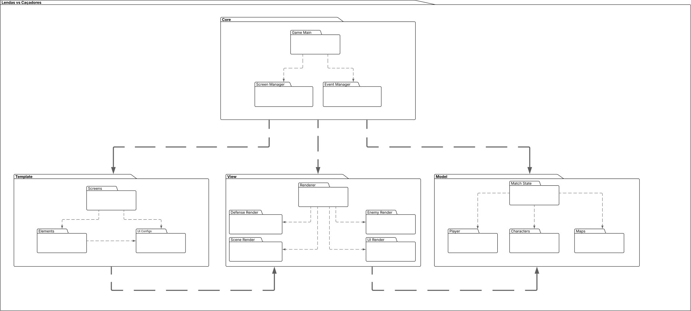

# 2.3. Módulo Notação UML – Modelagem Organizacional OU Casos de Uso

## Introdução

A **Modelagem Organizacional** na **Unified Modeling Language (UML)** é essencial para compreender como os atores interagem com o sistema e como as funcionalidades se organizam em níveis estruturais. Enquanto a modelagem estática descreve classes e componentes, a modelagem organizacional foca em quem utiliza o sistema e como suas funções são distribuídas em pacotes.

Essa visão contribui para alinhar expectativas entre usuários, desenvolvedores e gestores, oferecendo uma representação clara das responsabilidades do sistema e da organização modular da arquitetura. A UML fornece notações específicas, como **diagramas de caso de uso** e **diagramas de pacotes**, que favorecem tanto a análise quanto a comunicação entre os envolvidos no projeto.

## Metodologia

A metodologia aplicada pelo grupo concentrou-se em duas representações principais da modelagem organizacional em UML:

1. **Diagrama de Caso de Uso** – Representa as interações entre atores e o sistema, destacando funcionalidades e fluxos de uso.   Esse diagrama fornece uma visão funcional, auxiliando na identificação de requisitos e expectativas dos usuários.

2. **Diagrama de Pacotes** – Estrutura o sistema em módulos lógicos, agrupando classes e componentes com responsabilidades relacionadas.   Esse diagrama evidencia a organização modular, facilitando a compreensão da arquitetura e das dependências entre partes do sistema.

O processo metodológico envolveu:

- **Identificação dos atores principais** que interagem com o sistema.  
- **Levantamento dos principais casos de uso**, descrevendo o valor entregue a cada ator.  
- **Organização do sistema em pacotes lógicos**, agrupando elementos com funções semelhantes.  
- **Construção dos diagramas UML**, aplicando padrões visuais para garantir consistência e clareza na comunicação.  

## Participantes

Tabela 1: Participantes

<table>
  <thead>
    <tr>
      <th>Nome</th>
      <th>Função</th>
      <th>Data</th>
      <th>Hora</th>
    </tr>
  </thead>
  <tbody>
    <tr>
      <td><a href="https://github.com/caioduart3">Caio Duarte</a></td>
      <td>Diagrama de Pacotes</td>
      <td>16/09/2025</td>
      <td>21:00</td>
    </tr>
    <tr>
      <td><a href="https://github.com/danielle-soaress">Danielle Soares</a></td>
      <td>Diagrama de Pacotes</td>
      <td>16/09/2025</td>
      <td>21:00</td>
    </tr>
    <tr>
      <td><a href="https://github.com/EnzoEmir">Enzo Emir</a></td>
      <td></td>
      <td></td>
      <td></td>
    </tr>
    <tr>
      <td><a href="https://github.com/felixlaryssa">Laryssa Félix</a></td>
      <td></td>
      <td></td>
      <td></td>
    </tr>
    <tr>
      <td><a href="https://github.com/Leticia-Arisa-K-Higa">Leticia Arisa</a></td>
      <td></td>
      <td></td>
      <td></td>
    </tr>
    <tr>
      <td><a href="https://github.com/MM4k">Marcelo Makoto</a></td>
      <td></td>
      <td></td>
      <td></td>
    </tr>
    <tr>
      <td><a href="https://github.com/dudaa28">Maria Eduarda</a></td>
      <td>Diagrama de Pacotes</td>
      <td>16/09/2025</td>
      <td>21:00</td>
    </tr>
    <tr>
      <td><a href="https://github.com/RafaelSchadt">Rafael Welz</a></td>
      <td></td>
      <td></td>
      <td></td>
    </tr>
    <tr>
      <td><a href="https://github.com/VictorPontual">Victor Pontual</a></td>
      <td></td>
      <td></td>
      <td></td>
    </tr>
  </tbody>
</table>

## 2.3.1. Diagrama de Pacotes

O diagrama de pacotes é um diagrama estrutural da UML utilizado para representar a organização e a disposição de elementos de um sistema em forma de pacotes. Cada pacote funciona como um agrupamento lógico de componentes relacionados, como classes, casos de uso, documentos ou até outros pacotes, e é representado visualmente por um ícone semelhante a uma pasta [[1]](rref1).

A ferramenta utilizada para a elaboração do diagrama foi o **Lucidchart**, possibilitando a edição simultânea, o que favoreceu a organização do processo e a clareza na modelagem. O link para o projeto pode ser acessado clicando [aqui](https://lucid.app/lucidchart/8c2d9ae3-87b4-4417-babb-2605b3b5a9d0/edit?invitationId=inv_53ce21a1-43e9-4fbd-9161-098e1dc0fa23) (é necessário login).  

Fonte: Caio Duarte, Danielle Soares, Maria Eduarda, 2025.

Este diagrama de pacotes mostra a organização lógica do código do jogo, dividindo-o em pacotes principais e suas dependências.

#### Core
O pacote central que gerencia a lógica principal do jogo.  
**Classes/Componentes:**

- **Game Main**: Classe principal que coordena o fluxo do jogo.  
- **Screen Manager**: Gerencia as diferentes telas do jogo.  
- **Event Manager**: Responsável por lidar com eventos de entrada do usuário.  

**Dependências:**  

  - Core depende de **Template**, **View** e **Model**.

#### Template
Contém elementos de interface de usuário e configurações de tela.  
**Subpacotes/Classes:**

- **Screens**: Define as telas do jogo.  
- **Elements**: Agrupa os elementos gráficos.  
- **UI Configs**: Configurações da interface.  

**Dependências:**  

  - **Elements** usa **UI Configs**.

#### View

Responsável pela renderização (exibição) do jogo.  
**Subpacotes/Classes:**

  - **Renderer**: Gerencia a renderização dos componentes.  
  - **Defense Render**: Renderiza a defesa.  
  - **Enemy Render**: Renderiza os inimigos.  
  - **Scene Render**: Renderiza a cena do jogo.  
  - **UI Render**: Renderiza a interface do usuário.  

**Dependências:**  

  - View depende de **Model**.

#### Model

Contém a lógica de dados e o estado do jogo.  
**Subpacotes/Classes:**

  - **Mach State**: Armazena o estado atual do jogo.  
  - **Player**: Contém os dados do jogador (nome, quantidade de moedas, atributos específicos) e sua lógica de funcionamento.  
  - **Characters**: Agrupa todos os personagens do jogo, definindo sua lógica e estados (incluindo inimigos e outros NPCs).  
  - **Maps**: Define a lógica e o estado dos mapas.  

**Dependências:**  

  - **Game State** se relaciona com **Player**, **Characters** e **Maps**.

A arquitetura do jogo segue o padrão de design **Model-View-Controller (MVC)**, ou uma variação dele, em que: 

  - O **Core** atua como o "cérebro" que coordena as interações.  
  - O **View** cuida da renderização.  
  - O **Model** gerencia os dados e estados do jogo.  
  - O **Template** organiza os elementos da interface.  

Essa estrutura garante modularidade, clareza e organização no desenvolvimento.

#### Comentários sobre o Trabalho em Equipe

A elaboração desta etapa foi realizada em reunião pelo **Discord**, não gravada, contando com a participação dos três membros designados para o **Diagrama de Pacotes**. Todos os integrantes estiveram presentes diretamente na execução prática do diagrama e contribuiram tanto no estudo aprofundado sobre o tema quanto na documentação principal. 

Assim, de forma **presencial e online**, todos os três membros — **Caio Duarte, Danielle Soares e Maria Eduarda Andrade** — participaram ativamente do **Foco 3**, garantindo integração e alinhamento entre teoria e prática. A participação dos integrantes na elaboração do **Foco 3** trouxe visões e opiniões distintas, enriquecendo o trabalho desenvolvido:  

  
<strong><a href="https://github.com/caioduart3">Caio Duarte</a></strong>

  
texto aqui

  
<strong><a href="https://github.com/danielle-soaress">Danielle Soares</a></strong>

  
Eu achei o diagrama de pacotes mais intuitivo, mas ainda assim difícil definir os limites de cada pacote. Foi útil para entender como separar funcionalidades e manter o sistema modular, além de ser um pouco abstrato nesse primeiro momento em que ainda estamos avançando no projeto.

  
<strong><a href="https://github.com/dudaa28">Maria Eduarda Andrade</a></strong>

  
Achei a ideia do diagrama de pacotes bastante direta e relevante, pois traz uma visão mais próxima da nossa realidade cotidiana. Ele me remete, por exemplo, à organização de alimentos na cozinha em pequenos potes, cada um destinado a um tipo ou a um conjunto específico de alimentos. Partindo dessa analogia, o diagrama de pacotes mostra-se muito útil para compreendermos a forma como estruturamos nosso sistema e suas interligações. No entanto, considerei sua construção um pouco difícil, devido à amplitude e complexidade envolvidas, embora isso seja algo que pode ser aprimorado com a prática.

>>  LUCIDCHART. Tutorial sobre diagramas de pacotes UML. Lucidchart. Disponível em: https://www.lucidchart.com/pages/pt/diagrama-de-pacotes-uml
. Acesso em: 20 set. 2025.

## Histórico de Versões 📅

| Versão | Data | Descrição | Autor(es) | Revisor(es) |
| :--: | :--: | :--: | :--: | :--: |
| `0.1` | 20/09/2025 | Adicionando Diagrama de Pacotes | [Caio Duarte](https://github.com/caioduart3), [Danielle Soares](https://github.com/danielle-soaress), [Maria Eduarda Andrade](https://github.com/dudaa28) | - |
| `0.2` | 20/09/2025 | Corrigindo link da imagem | [Caio Duarte](https://github.com/caioduart3), [Danielle Soares](https://github.com/danielle-soaress) | [Maria Eduarda Andrade](https://github.com/dudaa28) |
| `0.3` | 20/09/2025 | Adicionando introdução da página de modelagem organizacional, tabela de participantes e comentários sobre o trabalho em equipe. | [Danielle Soares](https://github.com/danielle-soaress) | [Maria Eduarda Andrade](https://github.com/dudaa28) |
| `0.4` | 21/09/2025 | Adicionando descrição do diagrama de pacotes | [Caio Duarte](https://github.com/caioduart3), [Danielle Soares](https://github.com/danielle-soaress), [Maria Eduarda Andrade](https://github.com/dudaa28) | - |